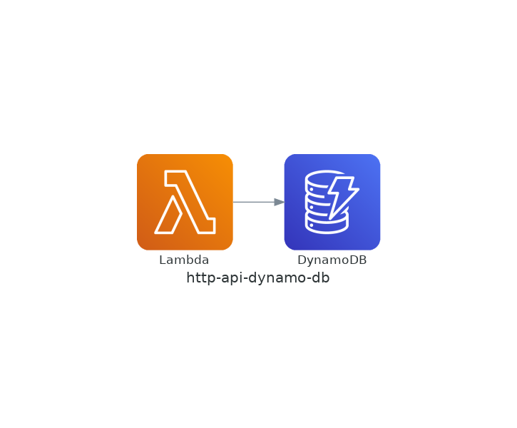

# Welcome to your CDK TypeScript project

This is a blank project for CDK development with TypeScript.

The `cdk.json` file tells the CDK Toolkit how to execute your app.

## Useful commands

* `npm run build`   compile typescript to js
* `npm run watch`   watch for changes and compile
* `npm run test`    perform the jest unit tests
* `cdk deploy`      deploy this stack to your default AWS account/region
* `cdk diff`        compare deployed stack with current state
* `cdk synth`       emits the synthesized CloudFormation template

## Usage

```bash
# パッケージの初期化
npm install
# AWS アカウントとリージョンをブートストラップ
cdklocal bootstrap aws://000000000000/us-east-1
# スタックのデプロイ
cdklocal deploy
# Lambda関数のFunctionNameを確認
awslocal lambda list-functions
# 関数URLを確認
# FunctionNameは直前に確認した値に置き換える
awslocal lambda get-function-url-config --function-name FunctionName
# DynamoDBのテーブル名を確認
awslocal dynamodb list-tables
# テストデータを記述するJSONファイルを生成
touch test.json
# test.jsonの内容をDynamoDBに追加
awslocal dynamodb batch-write-item --request-items file://test.json
# データが正常に追加されていることを確認
# TableNameはDynamoDBのテーブル名に置き換える
awslocal dynamodb scan --table-name TableName
# ブラウザで関数URLにアクセス
# FunctionUrlは関数URLの値に置き換える
# URLの末尾の数字は登録したデータのidを指定する
# 登録したデータがJSONで返却されたら成功
curl -i http://FunctionUrl/items/1
# アプリのリソースを破棄
cdklocal destroy
```

Example of `test.json`. Replace `TableName` with your DynamoDB table name.

```json
{
    "TableName": [
        {
            "PutRequest": {
                "Item": {
                    "id": {
                        "S": "1"
                    },
                    "task": {
                        "S": "task 1"
                    },
                    "done": {
                        "BOOL": true
                    }
                }
            }
        },
        {
            "PutRequest": {
                "Item": {
                    "id": {
                        "S": "2"
                    },
                    "task": {
                        "S": "task 2"
                    },
                    "done": {
                        "BOOL": false
                    }
                }
            }
        },
        {
            "PutRequest": {
                "Item": {
                    "id": {
                        "S": "3"
                    },
                    "task": {
                        "S": "task 3"
                    },
                    "done": {
                        "BOOL": false
                    }
                }
            }
        }
    ]
}
```

## Architecture


