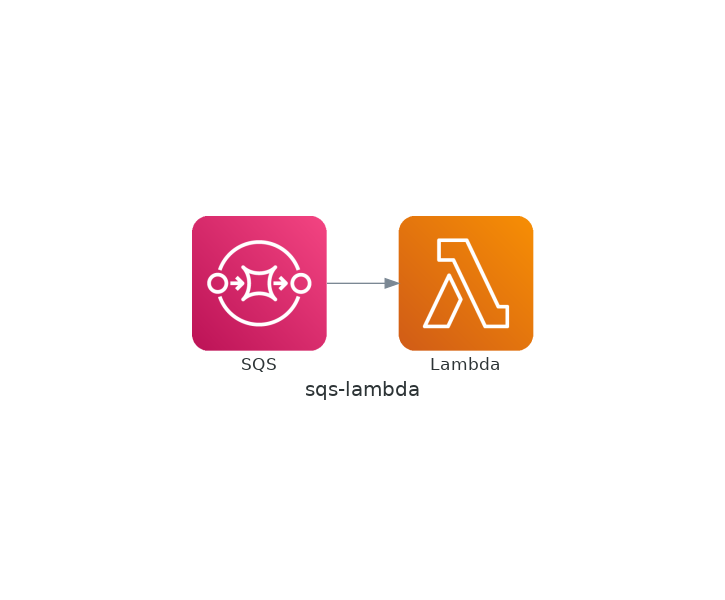

# Welcome to your CDK TypeScript project

This is a blank project for CDK development with TypeScript.

The `cdk.json` file tells the CDK Toolkit how to execute your app.

## Useful commands

* `npm run build`   compile typescript to js
* `npm run watch`   watch for changes and compile
* `npm run test`    perform the jest unit tests
* `cdk deploy`      deploy this stack to your default AWS account/region
* `cdk diff`        compare deployed stack with current state
* `cdk synth`       emits the synthesized CloudFormation template

## Usage

```bash
npm install
cdklocal bootstrap aws://000000000000/us-east-1
# スタックをLocalStackにデプロイ
cdklocal deploy
# デプロイしたLambda関数の名前を確認
awslocal lambda list-functions --query 'Functions[].[FunctionName,Runtime]' --output text
# 変数にLambda関数の名前を代入
# FunctionNameはLambda関数の名前に置き換える
FUNCTION_NAME=FunctionName
# デプロイしたSQSのキューを確認
awslocal sqs list-queues
# 変数にキューのURLを代入
# QueueNameはLambda関数の名前に置き換える
QUEUE_URL=QueueName
# CLIでキューにメッセージを送信
awslocal sqs send-message --queue-url ${QUEUE_URL} --message-body "hello world"
# Lambda関数のログを確認
# hello worldが表示されれば成功
awslocal logs tail "/aws/lambda/${FUNCTION_NAME}"
```

## Architecture


